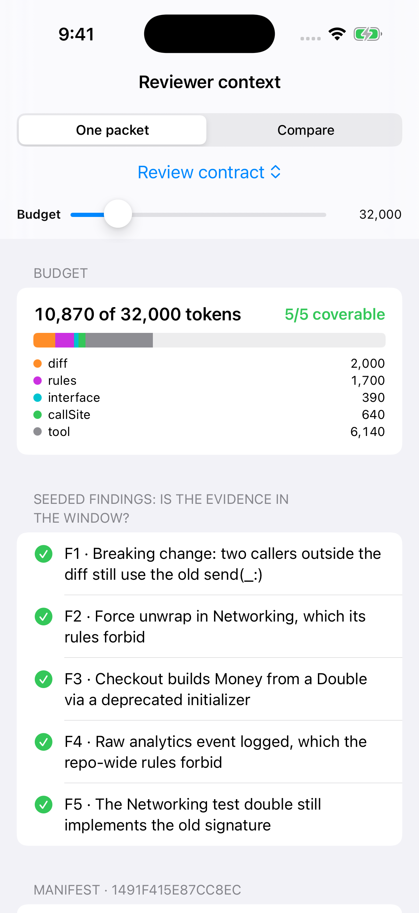
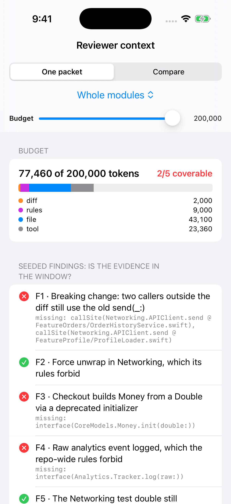
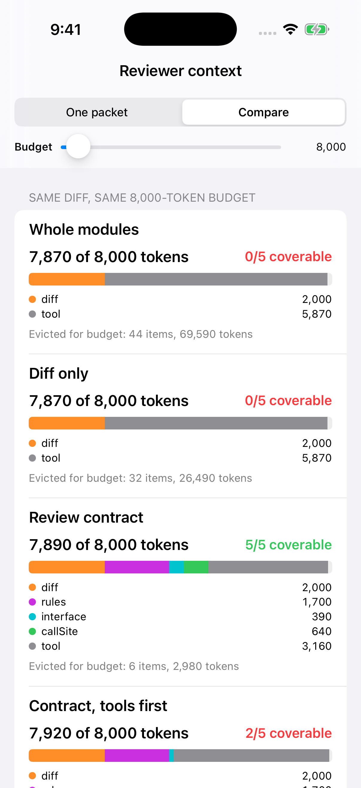

# ContextPacket

**Context engineering for a reviewer agent, written as a compiler.** Give it a modular iOS repository, a diff, the tools your agent harness exposes and a token budget. It returns the exact packet a reviewer subagent should see, a manifest you can diff in a PR, and which seeded findings that packet has the evidence for.

Article: (added after publish)



## What it shows

On a constructed 8-module monorepo and a constructed diff (a required `retry:` parameter added to `APIClient.send`, plus a checkout change), with five seeded findings:

| Strategy | Budget | Tokens used | Findings with evidence in the window |
|---|---|---|---|
| Whole modules (all files of touched modules, one 9,000-token `CLAUDE.md`, all 38 tools) | 32,000 | 31,700, of which **0 tokens of source files** | 1 of 5 |
| Diff only (diff, the same `CLAUDE.md`, all tools) | 32,000 | 31,700 | 1 of 5 |
| Whole modules, budget raised | 200,000 | 77,460 | 2 of 5 |
| **Review contract** | 32,000 | **10,870** | **5 of 5** |
| Review contract, tools packed first (my first draft) | 8,000 | 7,920 | 2 of 5 |
| Review contract | 8,000 | 7,890 | 5 of 5 |

Every number in this table is asserted by a test in `Tests/ContextPacketTests`.

"Evidence in the window" is a necessary condition, not a model benchmark: a reviewer cannot flag a caller it never saw. Whether a particular model notices it once it is there is a separate question this library does not answer.

## The contract

Abridged from `Compiler.swift` (the real `case` also handles `.contractToolsFirst`):

```swift
case .contract:
    let rules = repo.scopedRules                                   // root + touched modules only
        .filter { !$0.covers.isDisjoint(with: touchedModules.union([RuleFile.rootScope])) }
        .sorted { $0.path < $1.path }
        .map(rulesItem)
    let reviewTools = tools                                        // read/search/review, never write/deploy
        .filter { !$0.purposes.isDisjoint(with: reviewerPurposes) && !$0.purposes.contains(.write) && !$0.purposes.contains(.deploy) }
        .map(toolItem)
    let evidence = interfaceItems(repo: repo, changed: changed)    // cross-module stubs
        + callSiteItems(repo: repo, diff: diff)                     // reverse edges: who calls what changed
    return rules + evidence + reviewTools                           // evidence before tools
```

```swift
let packet = try PacketCompiler().compile(.contract,
                                          repo: SampleMonorepo.repository,
                                          diff: SampleMonorepo.diff,
                                          tools: SampleMonorepo.tools,
                                          budget: 32_000)
print(packet.manifest)       // stable, line-oriented, diffable
print(packet.fingerprint)    // FNV-1a over the manifest, not Hasher (seeded per process)
packet.coverage(of: SampleMonorepo.findings)
```

## Layout

- `Sources/ContextPacket/Model.swift`: repository, files, symbols, rule files, tools, diff
- `Sources/ContextPacket/Compiler.swift`: strategies and the first-fit packer
- `Sources/ContextPacket/Findings.swift`: evidence coverage and budget sweeps
- `Sources/ContextPacket/Manifest.swift`: manifest text and fingerprint
- `Sources/ContextPacket/SampleMonorepo.swift`: the constructed repo, diff, 38 tools and 5 findings (sizes are plausible, not measured)
- `Demo.xcodeproj` + `Demo/DemoApp.swift`: a SwiftUI app that consumes the library through a local package reference

## How to run it

```bash
git clone https://github.com/rajatslakhina/context-packet-article-demo.git
cd context-packet-article-demo
open Demo.xcodeproj
```

Pick any iPhone Simulator and press Run. No other setup. The library alone: `swift build && swift test`.

Launch arguments (used by CI for screenshots): `-strategy wholeModules|diffOnly|contract|contractToolsFirst`, `-budget 32000`, `-compare YES`.

## Screenshots

| Review contract, 32k | Whole modules, 200k | All strategies, 8k |
|---|---|---|
|  |  |  |

## Verification status

- Library: `swift build -Xswiftc -warnings-as-errors` and the 14 XCTest cases pass on Swift 6.1.2 (Linux) and in CI on macOS (`swift test`).
- Simulator: **yes, in GitHub Actions (`macos-15`), not on a local Mac.** The `demo-on-simulator` job builds `Demo.xcodeproj` with `xcodebuild`, installs it on an iPhone Simulator, launches it three times with the launch arguments above, checks the app process is still alive after 8 seconds, and commits the three screenshots above. Nobody tapped the UI by hand.
- Local note: in the Linux sandbox the `swift test` CLI hung before running anything, so the built XCTest bundle was run directly there (14/14 pass). CI runs `swift test` on macOS, and that passes too.

## Sources

- Anthropic, [Effective context engineering for AI agents](https://www.anthropic.com/engineering/effective-context-engineering-for-ai-agents)
- Birgitta Böckeler on martinfowler.com, [Context Engineering for Coding Agents](https://martinfowler.com/articles/exploring-gen-ai/context-engineering-coding-agents.html)

MIT licensed.
